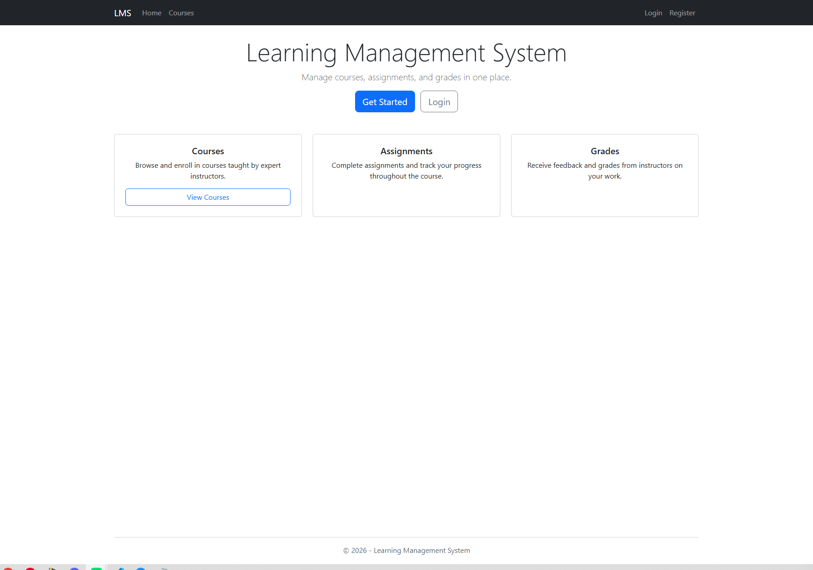
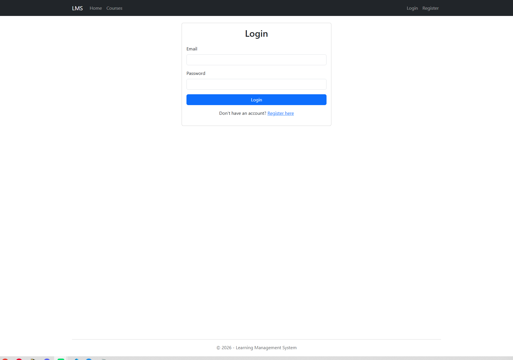
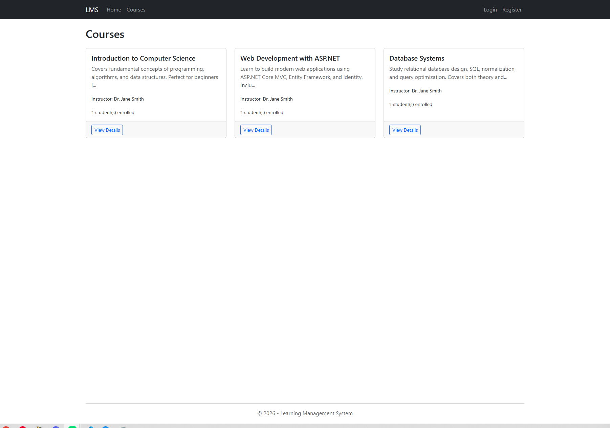
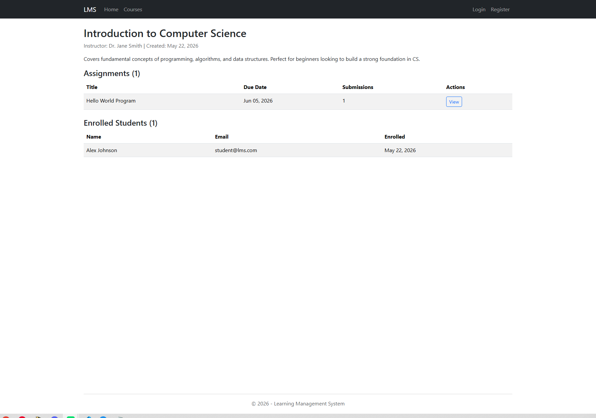
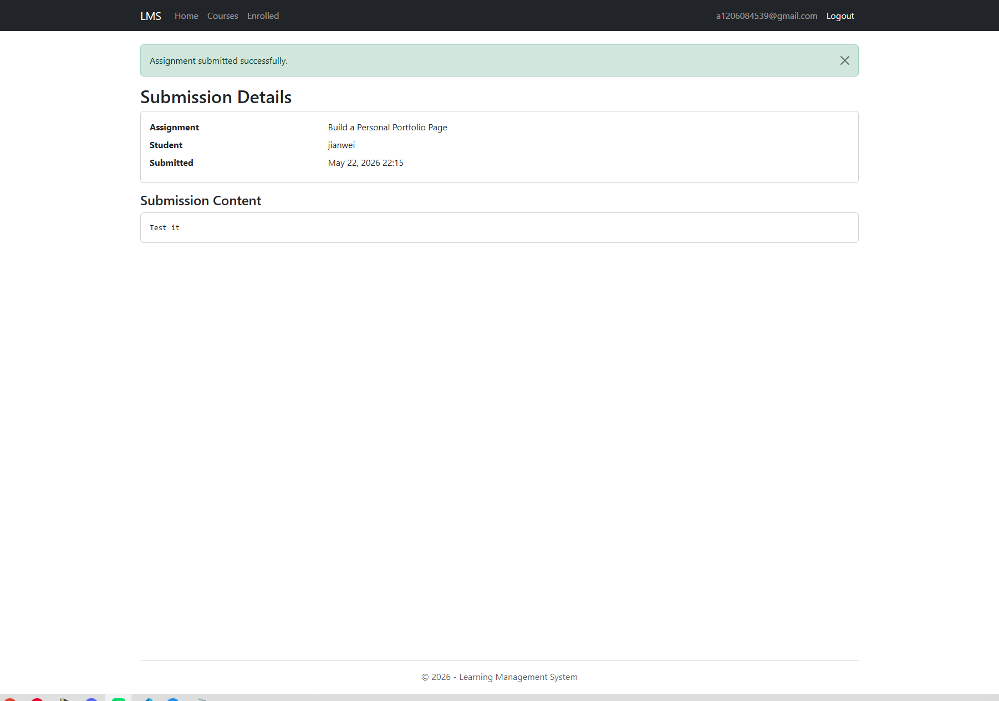
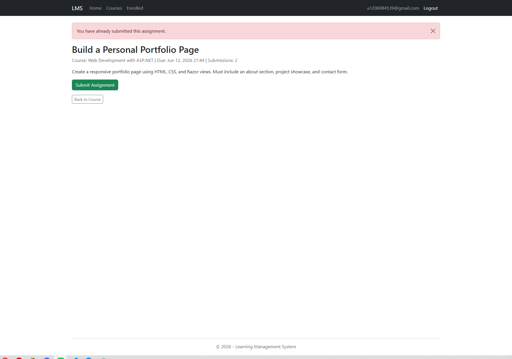
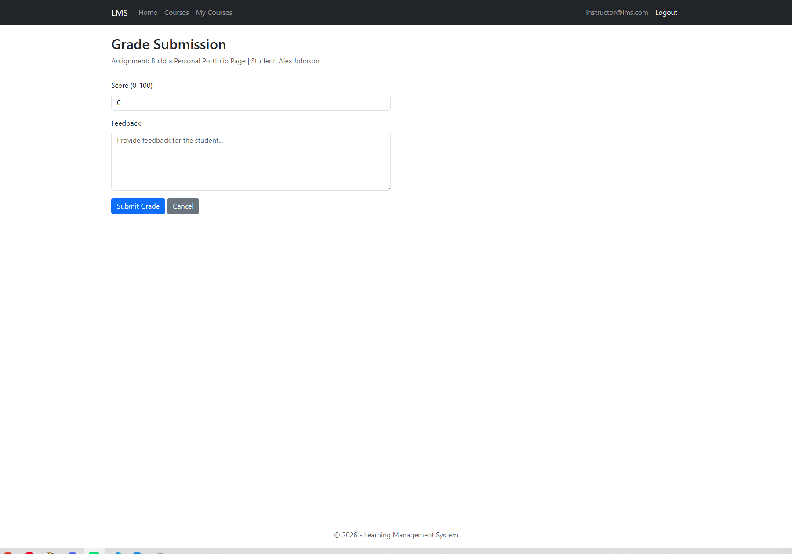
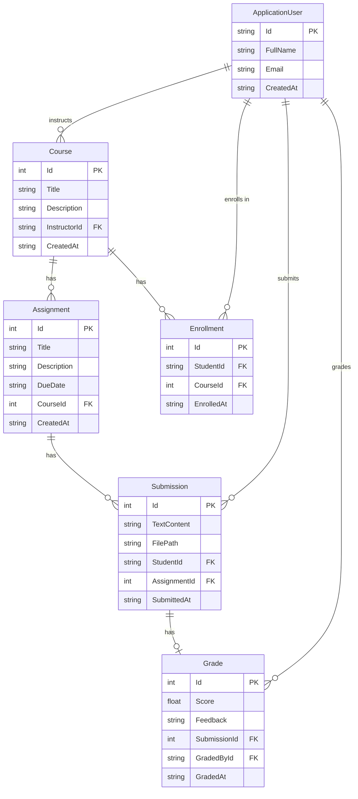

# Learning Management System (LMS)


A full-stack, cloud-deployed Learning Management System built with **ASP.NET Core 9 MVC**, **Entity Framework Core**, and **MySQL**. Supports role-based access for Admins, Instructors, and Students — with CI/CD, S3 file storage, structured logging, and a comprehensive test suite.

### Highlights

- **Result pattern** for explicit error handling — no exception-driven control flow
- **AWS S3 integration** with pre-signed URLs, file validation, and automatic cleanup on resubmit
- **CI/CD pipeline** via GitHub Actions — auto-builds, pushes to Docker Hub, and deploys to EC2
- **Server-side pagination** using a generic `PagedResult<T>` pushed down to the database
- **Unit tests** with xUnit and in-memory SQLite covering all service-layer logic

## Tech Stack

| Layer | Technology |
|-------|-----------|
| Backend | ASP.NET Core 9 MVC, C# |
| ORM | Entity Framework Core (Pomelo MySQL provider) |
| Database | MySQL 8.0 |
| Authentication | ASP.NET Identity, cookie-based sessions |
| Authorization | Role-based (Admin, Instructor, Student) |
| Frontend | Razor Views, Bootstrap 5 |
| Logging | Serilog (structured logging to console + file sinks) |
| Testing | xUnit, SQLite in-memory |
| Containerization | Docker, Docker Compose |
| CI/CD | GitHub Actions |
| File Storage | AWS S3 (pre-signed URLs) |
| Cloud | AWS EC2 |

## Live Demo

**URL:** http://18.234.45.126

Demo accounts for each role (Admin, Instructor, Student) are seeded automatically on startup. See [`Data/SeedData.cs`](Learning%20Management%20System/Data/SeedData.cs) for credentials.

## Features

### Course Management

- **Role-based access control** — Three distinct roles with dedicated dashboards and permissions
- **Course CRUD** — Instructors create and manage courses; students browse and enroll
- **Duplicate enrollment handling** — Friendly warnings instead of generic error pages

### Submissions & Grading

- **Assignments with deadlines** — Instructors create assignments with due dates; students submit work
- **S3 file uploads** — Files stored in AWS S3 with pre-signed download URLs (15-min expiry) and automatic cleanup on resubmit
- **Assignment resubmission** — Students can revise and resubmit before the deadline; locked after grading or past due
- **Grading with upsert pattern** — Instructors score submissions (0-100) with written feedback; duplicate grade attempts handled gracefully

### Infrastructure

- **Auto-seeded demo data** — Pre-loaded courses, assignments, and users for immediate testing
- **Dockerized deployment** — One-command setup with Docker Compose
- **CI/CD pipeline** — Automatic build, push, and deploy to EC2 on every push to `main`
- **Structured logging** — Serilog with console and rolling-file sinks for production diagnostics

<details>
<summary>Screenshots</summary>

| Page | Preview |
|------|---------|
| Home |  |
| Login |  |
| Course List |  |
| Course Details |  |
| Submit Assignment |  |
| Successful Submission |  |
| Resubmission Warning |  |
| Grading |  |
| My Grades |  |

</details>

## Architecture & Design Decisions

**Result pattern over exceptions** — Service methods return `ServiceResult<T>` instead of throwing exceptions for expected errors (not found, unauthorized, duplicate). This replaces exception-driven control flow with **explicit success/failure paths**, making error handling predictable and testable. A global `ExceptionHandlingMiddleware` still catches truly unexpected failures as a safety net.

**Service layer with dependency inversion** — Controllers depend on **service interfaces** (`ICourseService`, `IAssignmentService`, etc.), not implementations. All business logic lives in the service layer; controllers only handle HTTP concerns and map `ServiceResult` outcomes to views. A shared `BaseController.HandleResult<T>()` method standardizes this mapping across all controllers.

**Server-side pagination** — List endpoints use a generic `PagedResult<T>` record and a `ToPagedResultAsync()` **extension method on `IQueryable<T>`**, pushing `Skip`/`Take` to the database rather than loading full tables into memory.

**S3 file storage with interface abstraction** — File operations go through `IFileStorageService`, keeping controllers and services **decoupled from AWS**. The implementation (`S3FileStorageService`) uses the AWS SDK to upload, delete, and generate pre-signed download URLs (15-min expiry). Files are organized under a hierarchical key structure (`courses/{id}/assignments/{id}/students/{id}/{uuid}.ext`). A `FileValidationHelper` enforces allowed extensions and a 25 MB size limit before any upload reaches S3. On EC2, credentials resolve via IAM instance profile; locally, explicit keys can be set via configuration.

**Structured logging with Serilog** — Replaced the default logging provider with Serilog for **structured, queryable logs**. Console and rolling-file sinks capture request context for production diagnostics.

**Pomelo MySQL provider** — Chosen over Oracle's MySQL connector because Pomelo is the community-recommended EF Core provider for MySQL, with broader feature support and active maintenance for .NET 9.

## Architecture

```
Learning Management System/
├── Controllers/           # MVC controllers (Course, Assignment, Submission, Grade, Account)
├── Models/                # EF Core entity models
├── Services/              # Business logic layer (interfaces + implementations)
├── DTOs/                  # Data transfer objects with validation
├── Views/                 # Razor views organized by controller
├── Data/                  # DbContext, migrations, seed data
├── Middleware/             # Global exception handling
├── wwwroot/               # Static assets (CSS, JS)
├── Dockerfile             # Multi-stage build (SDK → runtime)
├── docker-compose.yml     # App + MySQL containers
├── .github/workflows/     # CI/CD pipeline
└── LMS.Tests/             # Unit tests (xUnit + in-memory SQLite)
```

### Database Schema



## Getting Started

### With Docker (recommended)

```bash
git clone https://github.com/jianweicheng0822/learning-management-system.git
cd learning-management-system
cp .env.example .env       # edit passwords if you want
docker compose up --build
```

Visit http://localhost and log in with any demo account above.

### Without Docker

Prerequisites: .NET 9 SDK, MySQL Server

```bash
cd "Learning Management System"
# Set your connection string in appsettings.json or user secrets
dotnet run
```

The app auto-runs migrations and seeds demo data on startup when `SEED_DEMO_DATA=true`.

## Deployment

The app deploys to AWS EC2 via GitHub Actions. On every push to `main`:

1. GitHub Actions builds a Docker image and pushes it to Docker Hub
2. SSHs into EC2 and pulls the new image
3. Restarts the app container (MySQL data persists across deploys)

### Required GitHub Secrets

| Secret | Description |
|--------|-------------|
| `DOCKERHUB_USERNAME` | Docker Hub username |
| `DOCKERHUB_TOKEN` | Docker Hub access token |
| `EC2_HOST` | EC2 public IP address |
| `EC2_USER` | SSH user (e.g. `ubuntu`) |
| `EC2_SSH_KEY` | PEM private key contents |
| `AWS_ACCESS_KEY_ID` | IAM user access key for S3 |
| `AWS_SECRET_ACCESS_KEY` | IAM user secret key for S3 |
| `AWS_S3_BUCKET_NAME` | S3 bucket name (e.g. `lms-submissions`) |

## Testing

```bash
dotnet test LMS.Tests
```

Tests use **xUnit** with an **in-memory SQLite** database (no external dependencies required). Coverage includes:

- `CourseServiceTests` — course CRUD, ownership, and enrollment validation
- `AssignmentServiceTests` — assignment creation, retrieval, and authorization
- `SubmissionServiceTests` — submission creation, resubmission, deadline enforcement, and graded-lock validation
- `GradeServiceTests` — grading, feedback, and duplicate grade prevention
- `FileValidationHelperTests` — allowed/blocked extensions, size limits, and S3 key generation

## Routes

| Route | Description |
|-------|-------------|
| `/` | Home / Dashboard |
| `/Account/Login` | Login page |
| `/Account/Register` | Registration page |
| `/Account/Profile` | User profile |
| `/Course` | Browse all courses |
| `/Course/Details/{id}` | Course details with assignments |
| `/Course/Create` | Create course (Instructor/Admin) |
| `/Course/MyCourses` | Instructor's courses |
| `/Course/Enrolled` | Student's enrolled courses |
| `/Assignment/Details/{id}` | Assignment details |
| `/Submission/Create?assignmentId={id}` | Submit assignment (Student) |
| `/Submission/MySubmissions` | Student's submissions |
| `/Grade/MyGrades?courseId={id}` | Student's grades for a course |
